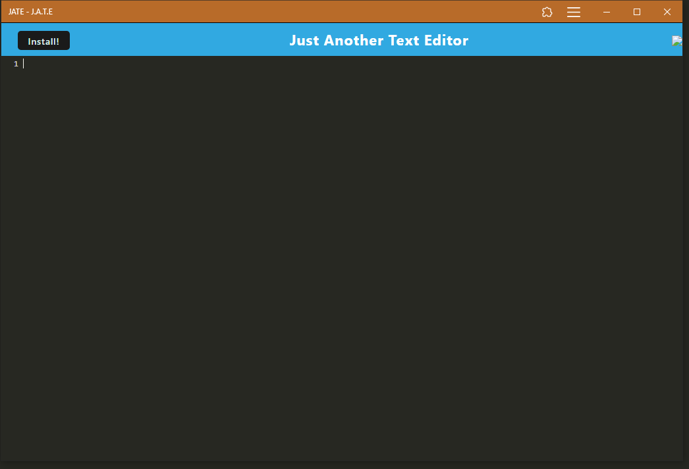

# Text Editor

## Description

Text Editor is a web application for editing text which can run offline. It is powered by [Express.js](https://www.npmjs.com/package/express), [idb](https://www.npmjs.com/package/idb) and [webpack-pwa-manifest](https://www.npmjs.com/package/webpack-pwa-manifest).

## Installation

The app is hosted on [https://text-editor-v5vs.onrender.com/](https://text-editor-v5vs.onrender.com/)
Follow the below steps to install on local computer.

- Step 1: clone project to your local computer.
- Step 2: navigate to "Text-Editor" folder.
- Step 3: run "npm install" to install the required modules.
- Step 4: run "npm start" to run a local back end webpage at http://localhost:10000

## Usage

- Step 1: Clisk on Install button to install to offline usage
- Step 2: Start typing from line 1

## Credits

Backend powered by [nodejs](https://nodejs.org/en), [idb](https://www.npmjs.com/package/idb), [webpack-pwa-manifest](https://www.npmjs.com/package/webpack-pwa-manifest), [express](https://www.npmjs.com/package/express).
